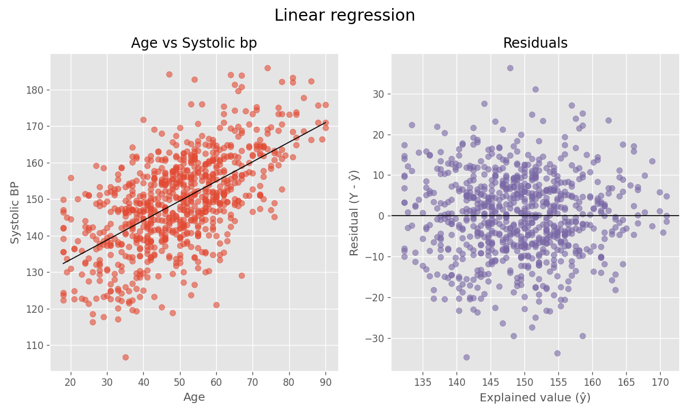
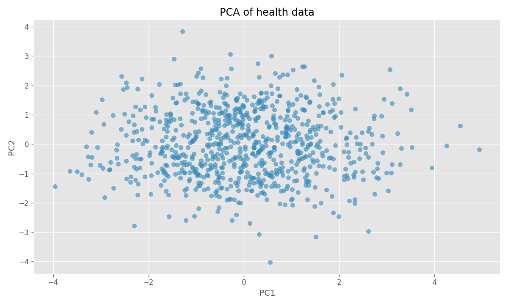

# Hälsostudie
Detta projekt innehåller en analys av hälsodata med fokus på blodtryck, rökvanor och relaterade faktorer.  
Analysen inkluderar beskrivande statistik, hypotesprövning, konfidensintervall, enkel linjär regression, PCA och multipel regression för att identifiera mönster och påverkande variabler.

## Rapport
### Beskrivande analys
- Sammanfattande statistik (medelvärde, median, min, max) beräknas för: age, weight, height, systolic_bp, cholesterol.
- Visualiseringar:  

### Simulering
Skillnaden mellan den verkliga sjukdomsfrekvensen (5.87 %) och den simulerade sjukdomsfrekvensen (5.4 %) är liten och ligger inom den förväntade variationen.  
Detta innebär att skillnaden vi ser i det verkliga data kan förklaras av slumpvariation snarare än av någon faktisk underliggande effekt.

### Konfidensintervall
- Beräknade 95%-konfidensintervall för medelvärdet av systoliskt blodtryck med två metoder: 
    - Normalapproximation: **148.29 - 150.07**
    - Bootstrap: **148.30 - 150.07**
Båda metoderna ger mycket liknande resultat, vilket tyder på att normalapproximationen är rimlig och att samplingfördelningen för medelvärdet är nära normal.
- Visualisering:  

### Hypotesprövning
H0: Rökare och icke-rökare har samma blodtryck *(mean_smokers = mean_non_smokers)*  
H1: Rökare har högre blodtryck än icke-rökare *(mean_smokers > mean_non_smokers)*  

Eftersom p-värdet (p ≈ 0.32) är större än 0,05 kan vi inte förkasta H0. Teststatistiken var låg (t ≈ 0.45), vilket bekräftar att den observerade skillnaden inte är statistiskt signifikant. Det finns inte tillräckligt med bevis för att dra slutsatsen att rökare har högre blodtryck än icke-rökare.
- Visualisering:  

### Undersökning av hypotes­test säkerhet
- Beräkningar: 
    - **Effektstorlek (Cohen’s d)** ≈ 0.037  
    - **Teoretisk power** ≈ 0.12 
    - **Simulerad power** ≈ 0.11 
    - **Nödvändig effektstorlek** för att uppnå 80% power ≈ 0.20
    - **Nödvändig skillnad i medelvärde** för att uppnå 80% power ≈ 2.55 mmHg
I praktiken tyder detta på att rökstatus **inte är förknippad med någon kliniskt eller statistiskt meningsfull förändring av systoliskt blodtryck** i detta urval.

### Prediktion av systoliskt blodtryck genom ålder 
Koefficienten visar att blodtrycket i genomsnitt ökar med cirka **0.536 mmHg per år**.  

Modellen förklarar cirka **37% av variationen** (R² ≈ 0.37) i blodtrycket med hjälp av ålder.  

Det innebär att **ålder är en viktig, men inte ensam, förklarande faktor.**
- Visualisering:  

### Multipel linjär regression
För att förstå vilka faktorer som mest påverkar systoliskt blodtryck i datasettet, använder jag *ålder, vikt, längd* samt *kolesterol* som prediktorer.

Prediktorerna standardiserades för att jämföra effekter:
- **Ålder** är den starkast påverkande faktorn. En ökning med en standardavvikelse förväntas öka systoliskt blodtryck med ~7.6 mmHg.  
- **Vikt** har en måttlig effekt (~2.2 mmHg per SD).  
- **Längd och kolesterol** har mycket små effekter (0.47 och 0.45).     

Modellen förklarar cirka **41% av variationen** i blodtrycket (R² ≈ 0.41), vilket innebär att en stor del av variationen fortfarande inte förklaras av de inkluderade variablerna.  
**Ytterligare faktorer kan behöva undersökas** för att bättre förstå variationen i systoliskt blodtryck.

- Visualisering:

### Principal Component Analysis (PCA)
PCA hjälper till att identifiera vilka variabler som är mest dominerande för att förklara skillnader mellan individer:  
  
- **PC1 (x-axeln, varians: 0.409)** fångar den största variationen i data och de variabler som påverkar PC1 mest är ålder(0.573), systoliskt blodtryck(0.569) och kolesterol(0.526).  
- **PC2 (y-axeln, varians: 0.260)** fångar främst variation kopplad till kroppsstorlek, med starka bidrag från längd (0.694) och vikt (0.657).  

PCA-resultatet visar att ålder, **blodtryck och kolesterol** förklarar den största delen av variationen i datasetet. **Längd och vikt** står för den näst största delen av variationen.

- Visualisering:  

### Källor
**Konfidensintervall**:  
- https://www.youtube.com/watch?v=xjYEYBvPaSc [13/11/2025]  

**ttest_ind**:  
- https://docs.scipy.org/doc/scipy/reference/generated/scipy.stats.ttest_ind.html [12/11/2025]

**solve_power**:  
- https://docs.w3cub.com/statsmodels/generated/statsmodels.stats.power.ttestindpower.solve_power [12/11/2025]  
- https://www.statsmodels.org/stable/generated/statsmodels.stats.power.TTestPower.solve_power.html#statsmodels.stats.power.TTestPower.solve_power [12/11/2025]

**Docstrings**:  
- https://numpydoc.readthedocs.io/en/latest/format.html [24/11/2025]

**Linjär Regression**:  
- https://www.youtube.com/watch?v=ZsJ-DbKpD3s&t=4036s [24/11/2025]

**PCA**:  
- https://www.geeksforgeeks.org/data-analysis/principal-component-analysis-pca/ [24/11/2025]
- https://scikit-learn.org/stable/modules/generated/sklearn.decomposition.PCA.html [24/11/2025]

**Multipel Regression**:
- https://www.w3schools.com/python/python_ml_multiple_regression.asp [24/11/2025]
- https://scikit-learn.org/stable/modules/generated/sklearn.linear_model.LinearRegression.html [24/11/2025]
- *Scaling*: 
    - https://www.w3schools.com/python/python_ml_scale.asp [24/11/2025]
    - https://scikit-learn.org/stable/modules/generated/sklearn.preprocessing.StandardScaler.html [24/11/2025]

## Miljö
- Python: 3.13.7
- Paket: Numpy, Pandas, Matplotlib, Scipy, Jupyter, Scikit-learn (se requirements.txt)

## Kom igång
**klona projetet**  
git clone https://github.com/IreneGrisenti/health_study_project.git  
cd health_study_project  
git checkout -b del2 origin/del2  

(eller)  
  
**klona bara del2 branch**  
git clone -b del2 --single-branch https://github.com/IreneGrisenti/health_study_project.git

**Skapa och aktivera virtuell miljö**:  
python -m venv .venv

**Windows PowerShell**:  
.venv\Scripts\Activate

**macOS/Linux**:  
source .venv/bin/activate

**installera beroenden**:  
python -m pip install -r requirements.txt
