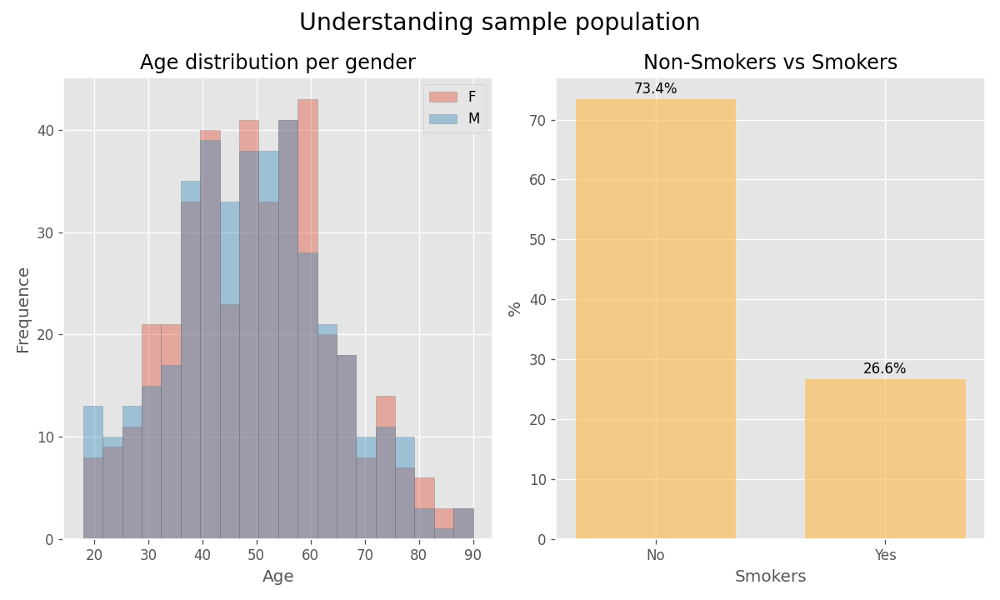
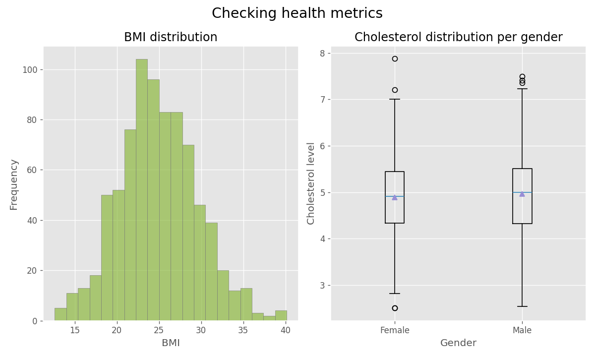
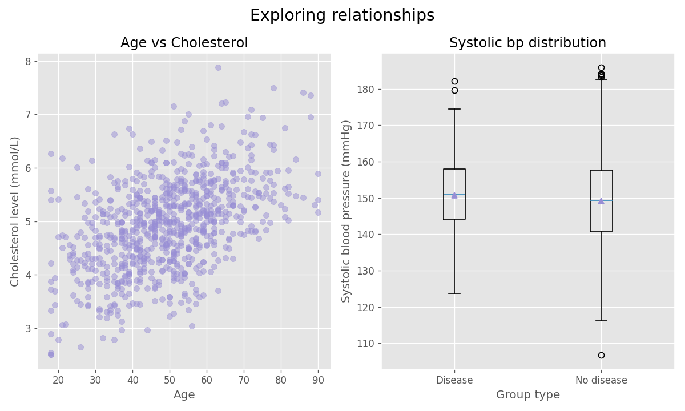
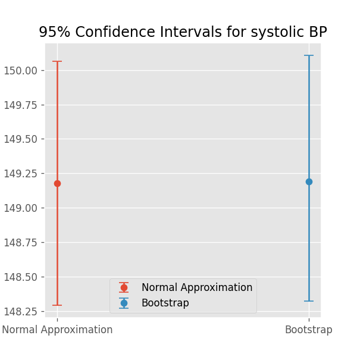

# Hälsostudie
Denna rapport analyserar en hälsodatamängd med fokus på rökning och blodtryck. Syftet är att beskriva data, beräkna konfidensintervall, genomföra hypotesprövning och utvärdera tillförlitligheten av resultaten genom simuleringar och power analys.

## Rapport
### Beskrivande analys
- Sammanfattande statistik (medelvärde, median, min, max) beräknas för: age, weight, height, systolic_bp, cholesterol.
- Visualiseringar:

### Simulering
- Beräknade andelen personer i datasetet som har sjukdomen: **5.88%**.
- Simulerade 1000 slumpmässiga individer med samma sannolikhet för sjukdom: **5.60%**
- Skillnaden mellan den verkliga sjukdomsfrekvensen och den simulerade sjukdomsfrekvensen är liten och ligger inom den förväntade variationen.

### Konfidensintervall
- Beräknade 95%-konfidensintervall för medelvärdet av systoliskt blodtryck med två metoder: 
    - Normalapproximation: **148.29 - 150.07**
    - Bootstrap: **148.32 - 150.11**
Båda metoderna gav ett mycket liknande resultat.
- Visualisering:  

### Hypotesprövning
- Testade hypotesen *"Rökare har högre medelblodtryck än icke-rökare."*
- Tvåprov och ensidig test:
    - t-värde på **0.450** 
    - p-värde på **0.326**
- Eftersom p-värdet är större än 0,05 kan vi inte förkasta H0. Det finns inte tillräcklig evidens för att dra slutsatsen att rökare har högre blodtryck än icke-rökare.
- Visualisering:  

### Power
- Både teoretisk och simulerad styrka beräknades för att jämföra resultaten:
    - Teoretisk power: **0.12**
    - Simulerad power: **0.11**
- Beräknad skillnad i medelvärde som krävs för att uppnå 80% styrka med givna stickprovsstorlekar: **2.55 mmHg**
- I praktiken bekräftar testet att rökstatus inte är förknippad med någon kliniskt eller statistiskt signifikant förändring av blodtrycket i detta urval.

### Källor
Scipy-dokumentation angående *ttest_ind*:  
- https://docs.scipy.org/doc/scipy/reference/generated/scipy.stats.ttest_ind.html [12/11/2025]

Dokumentation från w3cub och statsmodels angående *solve_power*:  
- https://docs.w3cub.com/statsmodels/generated/statsmodels.stats.power.ttestindpower.solve_power [12/11/2025]  
- https://www.statsmodels.org/stable/generated/statsmodels.stats.power.TTestPower.solve_power.html#statsmodels.stats.power.TTestPower.solve_power [12/11/2025]

## Miljö
- Python: 3.13.7
- Paket: Numpy, Pandas, Matplotlib, Scipy, Jupyter (se requirements.txt)

## Kom igång
**klona projetet**  
git clone https://github.com/IreneGrisenti/health_study_project.git  
cd health_study_project
git checkout -b del1 origin/del1

(eller)  
  
**klona bara del1 branch**
git clone -b del1 --single-branch https://github.com/IreneGrisenti/health_study_project.git

**Skapa och aktivera virtuell miljö**:  
python -m venv .venv

**Windows PowerShell**:  
.venv\Scripts\Activate

**macOS/Linux**:  
source .venv/bin/activate

**installera beroenden**:  
python -m pip install -r requirements.txt
